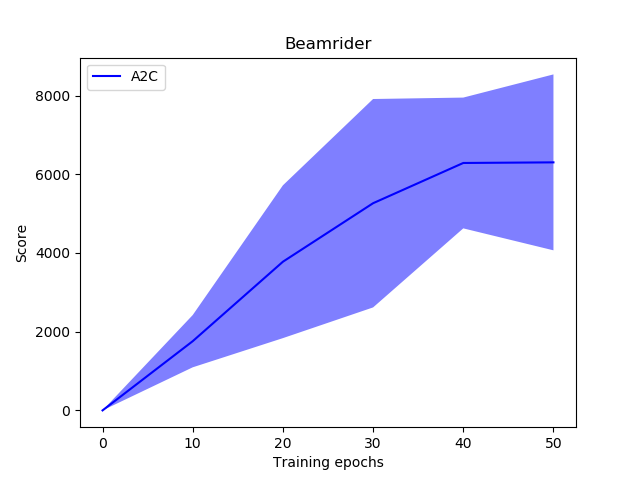
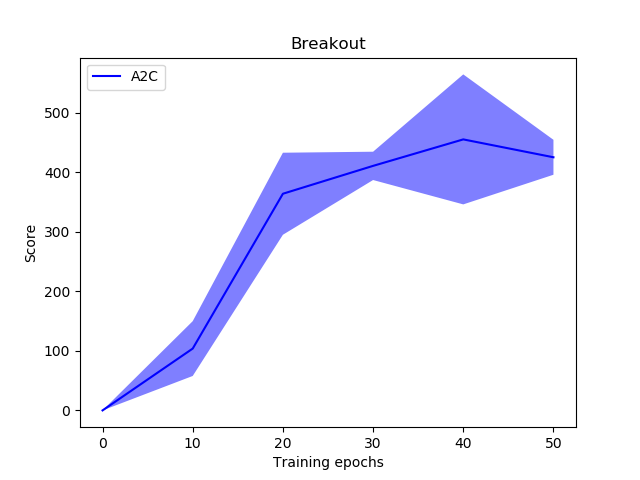
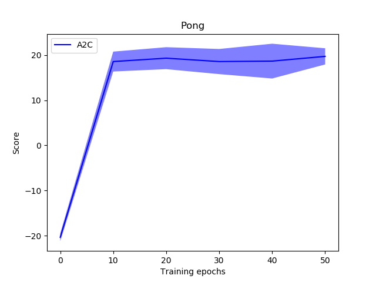
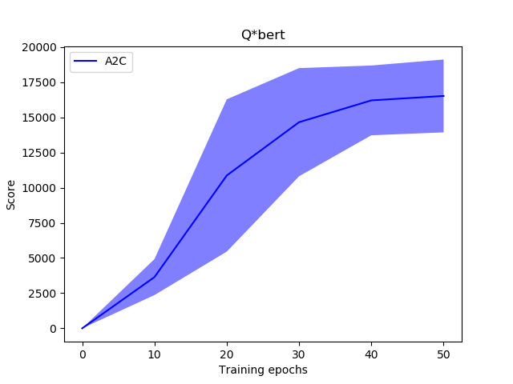
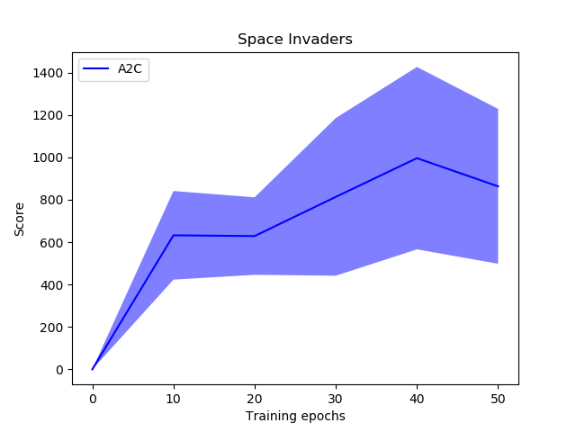

# A2C
An implementation of the Advantage Actor-Critic (A2C) algorithm - a synchronous adaptation of the Asynchronous Advantage Actor Critic (A3C) algorithm originally described in [Mnih et al. 2015][1]

This implementation was inspired by the OpenAI Baselines [implementation][2] of the same algorithm, and I have borrowed multiple pieces from there (mostly around gym environment wrappers)

# Results

Below are some high-level results for Beamrider, Breakout, Pong, Q\*bert and Space Invaders. They were obtained by running a policy (trained for the specified number of epochs with seed 0) 20 times on the environment, and taking the average score; the shaded area represents the standard deviation. We can see that the Q\*bert scores are significantly better than those achieved in the paper; Breakout and Pong are comparable; and Beamrider and Space Invaders are somewhat worse.

[1]: https://arxiv.org/pdf/1602.01783.pdf
[2]: https://github.com/openai/baselines/tree/master/baselines/a2c